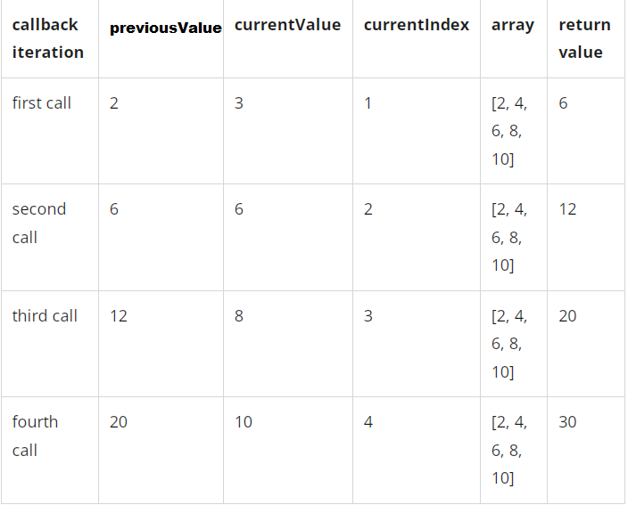

# I. Array.prototype.reduce() 
- The reduce() method executes a user-supplied "reducer" callback function on each element of the array, in order, passing in the return value from the calculation on the preceding element. The final result of running the reducer across all elements of the array is a single value.
- The first time that the callback is run there is no "return value of the previous calculation". If supplied, an initial value may be used in its place. Otherwise the array element at index 0 is used as the initial value and iteration starts from the next element (index 1 instead of index 0).
Example :

