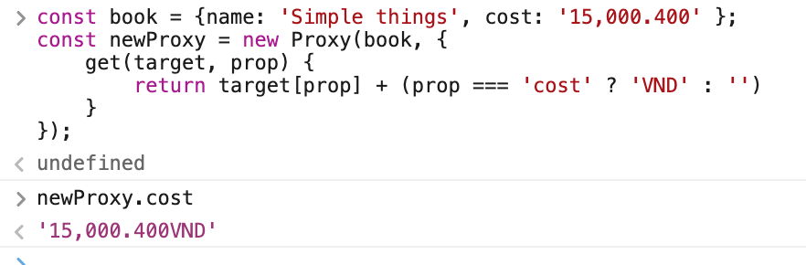
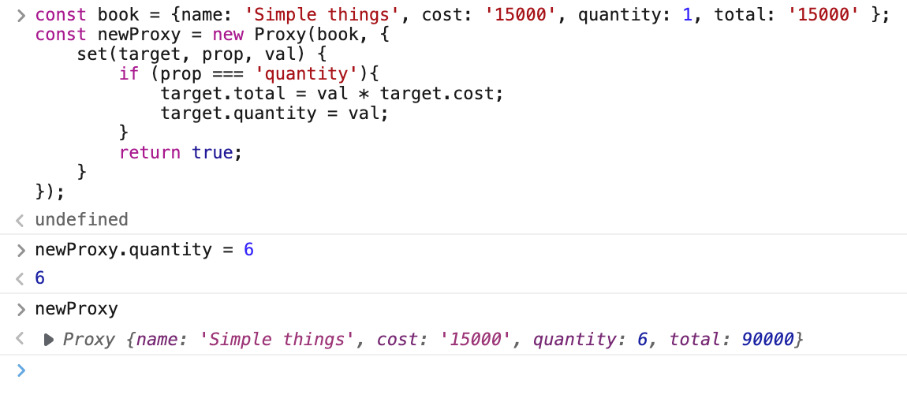
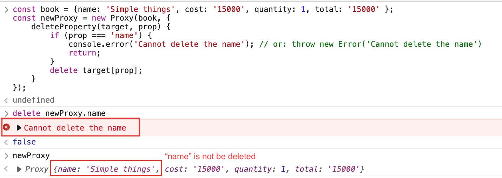
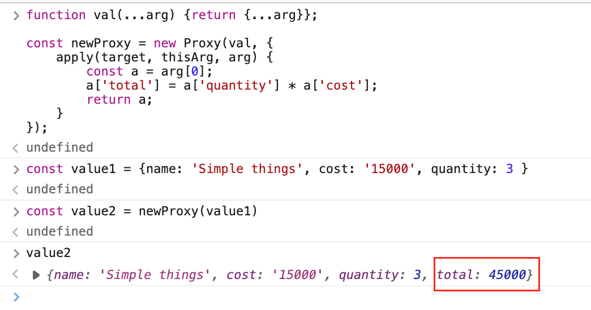
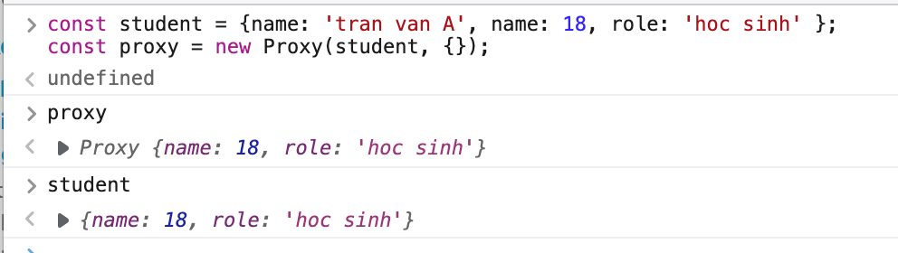
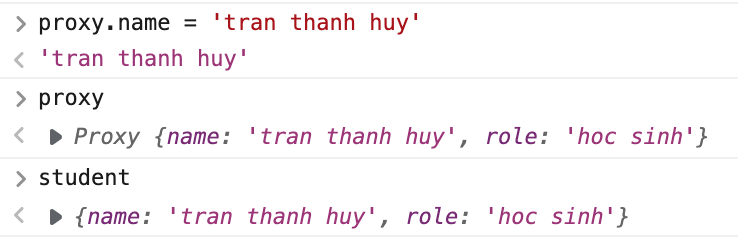
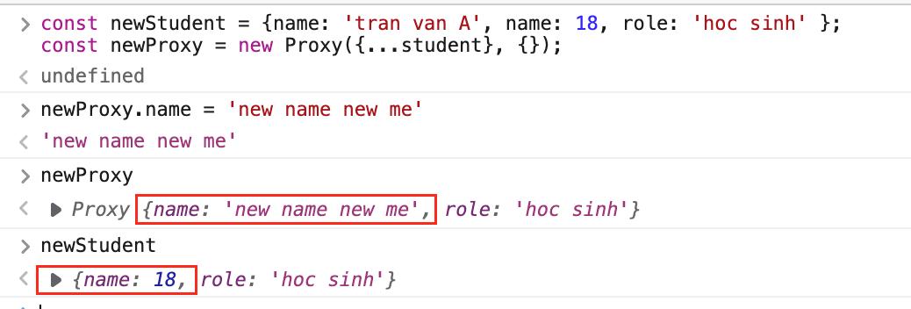

# Proxy
# Definition:
    Được giới thiệu từ es6, bản chất tương tự như một middleware có nhiệm vụ chuẩn hoá dữ liệu.
    Thưởng sử dụng cho việc truy cập property của 1 object, validation, format data, ...
---
# Syntax:
```const proxy = new Proxy(target, handler)```  
**Tham số:**   
-  *target(object):* object cần tạo proxy  
-  *handler(object):* cấu hình để ngăn chặn việc truy cập vào object, có thể hiểu nó như một middleware trước khi thao tác được với data.  

*Handler cung cấp các function để customize proxy như sau:*

### 1. handler.get(): 
    method dùng để lấy giá trị property.

> Có thể dùng để format dữ liệu như bên dưới:  
  

### 2. handler.set():
    method dùng để gán giá trị property

> Ví dụ: khi nhập quantity sẽ tự động tính total
  

### 3. handler.deleteProperty():
    Kiểm soát property nào được delete.

> Khi user xoá những key không mong muốn, thông báo lỗi trên console


### 4. handler.apply():
    method dùng để gọi function khác, đây là method có khả năng customize cực cao tuỳ thuộc vào function được gán vào.
> Ví dụ bên dưới sẽ thêm vào property "total" khi object gốc chỉ có quantity và cost


---
## Lưu ý:

    Tránh hiện tượng shallow clone.  

Khai báo proxy dựa trên object *"student"*



❌ Update giá trị của proxy, giá trị của object ban đầu cũng bị thay đổi theo



✅ Để khắc phục điều này, chỉ việc deep clone object gốc:  



---
## Tài liệu tham khảo:  
- Official doc(en): [Proxy - Javascript - MDN Web Docs](https://developer.mozilla.org/en-US/docs/Web/JavaScript/Reference/Global_Objects/proxy)  
- Viblo blog(vi): [Tìm hiểu về proxy trong javascript](https://viblo.asia/p/tim-hieu-ve-proxy-trong-javascript-yMnKMb0jZ7P)

