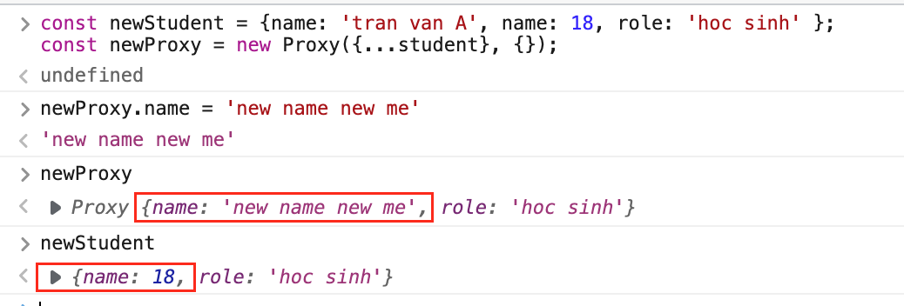

# Proxy
# Definition:
    Được giới thiệu từ es6, bản chất tương tự như một middleware có nhiệm vụ chuẩn hoá dữ liệu.
    Thưởng sử dụng cho việc truy cập property của 1 object, validation, format data, ...
---
# Syntax:
```const proxy = new Proxy(target, handler)```  
**Parameters:**   
-  *target(object):* the original object which you want to proxy 
-  *handler(object):* often called traps, these represent the operations that can 

*Handler provides many functions to customize your proxy as below:*

### 1. handler.get():  
    This is a trap for getting a property value.

> In case of data formatting:  
  

### 2. handler.set():*
    The *handler.set()* method is a trap for setting a property value.

> e.g: auto calculating property "total" when inputting "quantity"
  

### 3. handler.deleteProperty():
    The *handler.deleteProperty()* method is a trap for the delete operator.

> We can use it for prevent deleting unexpected property value


### 4. handler.apply():
    The *handler.apply()* method is a trap for a function call. It provides highly customization depending on the function assigned. 
> e.g: in the example of *handler.set()*, we can rewrite by *handler.apply()*


---
## Keep in mind:
    Avoiding mutation with Shallow Copy.

Declare a proxy based on object *"student"*


❌ When doing a shallow copy, the original object can be changed while working with proxy


✅ The correct way is to make a deep copy of the original object:  



---
## References:  
- Official doc(en): [Proxy - Javascript - MDN Web Docs](https://developer.mozilla.org/en-US/docs/Web/JavaScript/Reference/Global_Objects/proxy)  
- Viblo blog(vi): [Tìm hiểu về proxy trong javascript](https://viblo.asia/p/tim-hieu-ve-proxy-trong-javascript-yMnKMb0jZ7P)

